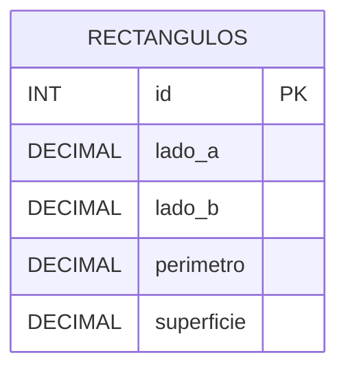

# Ejercicio 1

Desarrollar una API con ExpressJS para administrar rectángulos, persistiendo la
información en una base de datos MySQL.

Para cada rectángulo se deben almacenar sus dos lados, su perímetro y su
superficie. Al crear o modificar un rectángulo, la API debe recibir únicamente
los valores de sus lados. El perímetro y la superficie deben calcularse en el
servidor antes de persistir los datos; no deben aceptarse como valores enviados
por el cliente.

La API debe validar, como mínimo, que ambos lados estén presentes y sean valores
numéricos mayores que cero. También debe validar los parámetros, consultas y
cuerpo de las solicitudes que implemente, utilizando `express-validator`.

Definir los recursos, los métodos HTTP y las respuestas que considere
necesarios para gestionar los rectángulos. Fundamentar las decisiones de diseño
adoptadas para el modelo de datos y para la API.

## Decisiones de diseño

- **Recurso:** `/rectangulos`.
- **Persistencia:** tabla `rectangulos` en MySQL. Se guardan `lado_a`, `lado_b`,
  `perimetro` y `superficie`.
- **Cálculo en servidor:** el body solo admite `ladoA` y `ladoB`. Si el
  cliente envía `perimetro` o `superficie`, la API responde `400`. Esos
  valores se calculan en el servidor antes del `INSERT` / `UPDATE`.
- **Dato derivado:** `esCuadrado` se informa en la respuesta cuando
  `ladoA === ladoB`. No se persiste.
- **Métodos HTTP:**
  - `GET /rectangulos` — listar
  - `GET /rectangulos?esCuadrado=true|false` — filtrar cuadrados
  - `GET /rectangulos/:id` — consultar uno
  - `POST /rectangulos` — crear (`ladoA`, `ladoB`) → `201`
  - `PUT /rectangulos/:id` — reemplazar lados y recalcular
  - `DELETE /rectangulos/:id` — eliminar
- **Validaciones (`express-validator`):** `id` entero ≥ 1; `ladoA` y `ladoB`
  presentes y `> 0`; query `esCuadrado` solo `true`/`false`; `perimetro` y
  `superficie` no pueden venir en el body. Errores → `400`. Inexistente → `404`.

## Diagrama de entidades

## Cómo probar

1. Ejecutar `schema.sql` en MySQL (XAMPP / HeidiSQL).
2. Copiar `.env.example` a `.env`.
3. `npm install` y `npm run dev`.
4. Usar `rectangulos.http`.
