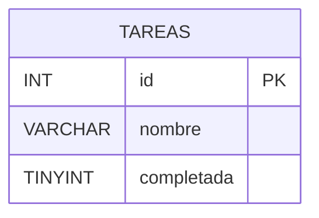

# Ejercicio 2

Desarrollar una API con ExpressJS para administrar una lista de tareas,
persistiendo la información en una base de datos MySQL.

Cada tarea debe incluir un nombre y un estado que indique si está completada.
La API debe impedir la creación de dos tareas con el mismo nombre. Definir y
aplicar un criterio de comparación consistente para determinar cuándo dos
nombres se consideran iguales.

Incorporar una forma de consultar las tareas según su estado: completadas o
pendientes. La API debe validar, como mínimo, que el nombre esté presente, sea
válido y respete la regla de unicidad; que el estado de una tarea sea un valor
booleano válido; y que el valor utilizado para filtrar pertenezca a los estados
admitidos. Validar además los parámetros, consultas y cuerpo de las solicitudes
que implemente utilizando `express-validator`.

Definir los recursos, los métodos HTTP y las respuestas que considere
necesarios para gestionar las tareas. Fundamentar las decisiones de diseño
adoptadas para el modelo de datos y para la API.

## Decisiones de diseño

- **Recurso:** `/tareas`.
- **Persistencia:** tabla `tareas` con `nombre` y `completada` (0/1).
- **Unicidad:** dos nombres son iguales si, luego de `trim`, coinciden sin
  distinguir mayúsculas (`LOWER`). Conflicto → `409`.
- **Filtro:** `GET /tareas?estado=completada` o `?estado=pendiente`.
- **Alta:** `completada` es opcional y por defecto `false`.
- **Métodos HTTP:**
  - `GET /tareas` — listar (con filtro opcional)
  - `GET /tareas/:id` — consultar una
  - `POST /tareas` — crear → `201`
  - `PUT /tareas/:id` — reemplazar nombre y estado
  - `DELETE /tareas/:id` — eliminar
- **Validaciones (`express-validator`):** `id` entero ≥ 1; `nombre` 1-80 letras
  y espacios; `completada` boolean; `estado` solo `completada` o `pendiente`.

## Diagrama de entidades

## Cómo probar

1. Ejecutar `schema.sql` en MySQL (XAMPP / HeidiSQL).
2. Copiar `.env.example` a `.env`.
3. `npm install` y `npm run dev`.
4. Usar `tareas.http`.
