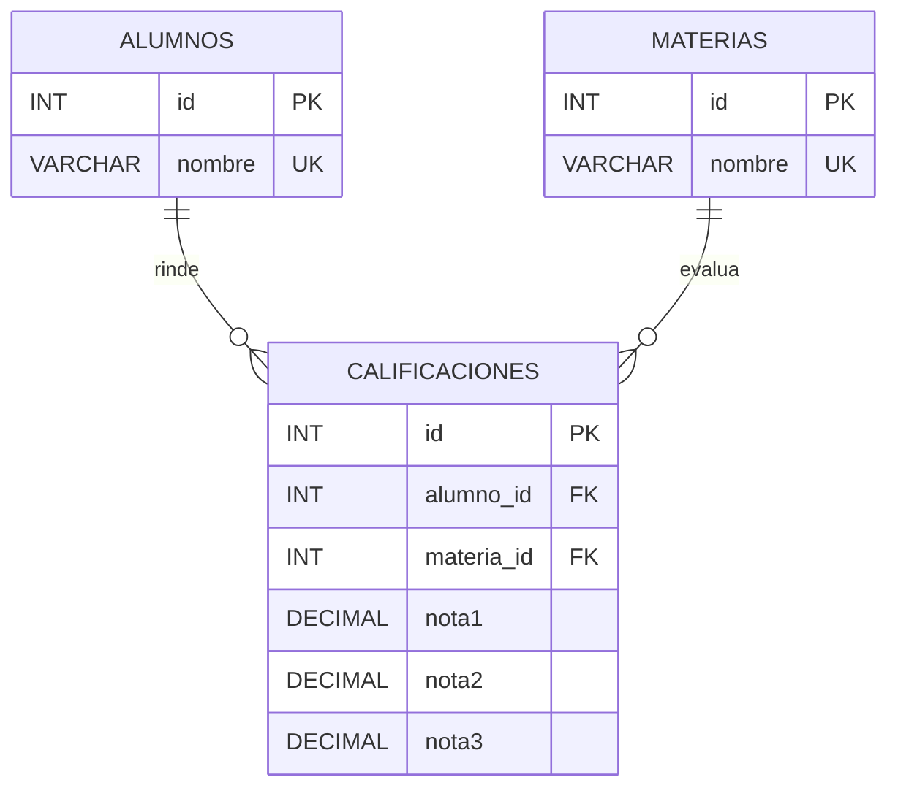

# Ejercicio 3

Desarrollar una API con ExpressJS para gestionar las calificaciones de alumnos
en las materias de una carrera, persistiendo la información en una base de datos
MySQL.

Para cada registro se debe almacenar el nombre del alumno, la materia cursada y
tres notas. Las materias deben modelarse en una tabla independiente y
relacionarse con los registros de alumnos mediante una clave foránea.

La API debe impedir que exista más de un registro para la misma combinación de
alumno y materia, tanto al crear como al modificar información. Debe validar,
como mínimo, que el nombre del alumno esté presente y sea válido; que la materia
exista; que se informen exactamente tres notas numéricas dentro de la escala
definida y documentada por el estudiante; y que se cumpla la regla de unicidad.
Validar además los parámetros, consultas y cuerpo de las solicitudes que
implemente utilizando `express-validator`.

Definir los recursos, los métodos HTTP y las respuestas que considere
necesarios para gestionar alumnos, materias y calificaciones. Fundamentar las
decisiones de diseño adoptadas para el modelo de datos y para la API.

## Decisiones de diseño

- **Recursos:** `/alumnos`, `/materias` y `/calificaciones`.
- **Modelo:** tres tablas. `materias` es independiente. Los registros de
  alumno-materia viven en `calificaciones`, que relaciona ambas tablas con
  claves foráneas (`alumno_id`, `materia_id`). Así se cumple que las materias
  se relacionan con los alumnos mediante FK, sin repetir el nombre de la
  materia. La unicidad alumno-materia se garantiza con
  `UNIQUE (alumno_id, materia_id)` y se verifica también en la API al crear
  y al modificar.
- **Escala de notas:** cada nota es un número de `0` a `10` inclusive.
- **Datos derivados:** `promedio` y `condicion` se calculan al responder; no
  se persisten.
  - `reprobado`: promedio &lt; 6
  - `aprobado`: promedio 6 o 7 (&lt; 8)
  - `promocionado`: promedio ≥ 8
- **Métodos HTTP:**
  - `GET|POST|PUT|DELETE /alumnos` y `GET /alumnos/:id/calificaciones`
  - `GET|POST|PUT|DELETE /materias` y `GET /materias/:id/calificaciones`
  - `GET /calificaciones` (filtros `alumnoId`, `materiaId`)
  - `GET|POST|PUT|DELETE /calificaciones/:id`
- **Validaciones (`express-validator`):** `id` entero ≥ 1; nombres 1-80 letras
  y espacios; `alumnoId` y `materiaId` enteros ≥ 1; `notas` arreglo de
  exactamente 3 valores entre 0 y 10. Materia o alumno inexistente → `400`.
  Par alumno-materia repetido → `409`. Inexistente → `404`. Alta → `201`.

## Diagrama de entidades

## Cómo probar

1. Ejecutar `schema.sql` en MySQL (XAMPP / HeidiSQL).
2. Copiar `.env.example` a `.env`.
3. `npm install` y `npm run dev`.
4. Usar `api.http`.
